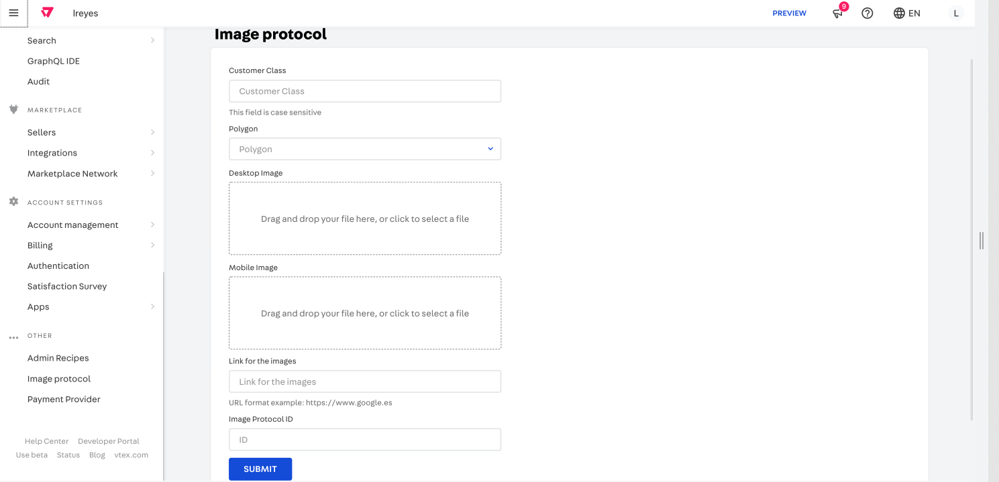
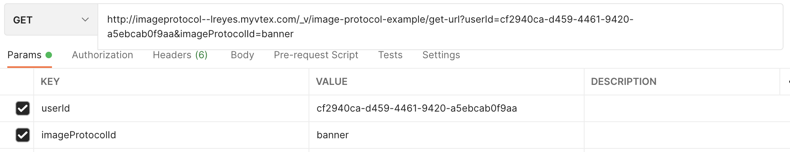

# Image Protocol Example



## Description

An example app to implement image protocol. This app creates a new section in the Admin panel through which the user can save data in vbase (in this case we are saving customer class, URLs for desktop and mobile, and the id for the image component that will render the image). At the same time this app creates the API endpoint to retrieve the URLs using the customer class and id of the image passed as params.

## GraphQL mutations

### In this example app, there are two mutations configured

- The first mutation is used to save the files and return the url

```graphql
mutation($file: Upload!) {
  uploadFile(file: $file) @context(provider: "vtex.file-manager-graphql") {
    fileUrl
  }
}
```

> **NOTE**: In order to use this mutation the file-manager-graphql is required as a dependency in the manifest.json:

```json
"dependencies": {
    "vtex.file-manager-graphql": "0.x"
  },
```

- The second one related to saving data in vbase

```graphql
mutation(
  $customerClassValue: String
  $url: String
  $urlMobile: String
  $idImg: String
) {
  customerClassInfo(
    customerClassValue: $customerClassValue
    url: $url
    urlMobile: $urlMobile
    idImg: $idImg
  ) {
    customerClassValue
    url
    urlMobile
    idImg
  }
}
```

Query variables:

```json
{
  "customerClassValue": "test",
  "url": "some url",
  "urlMobile": "some url",
  "idImg": "banner"
}
```

### API REST Endpoint to get data from vbase (passing user Id and image protocol Id)

There is an endpoint that can be used on Postman to get the data saved in vbase.
To do that, you can set userId and imageProtocolId as params


After doing that, you will receive a response similar to this one:

```json
{
  "url": "https://lreyes.vtexassets.com/assets/vtex.file-manager-graphql/images/261f8852-22b6-4048-b688-37a7d61ddd48___200c03de6f2e80dc23434cff4caf7f9a.jpeg",
  "urlMobile": "https://lreyes.vtexassets.com/assets/vtex.file-manager-graphql/images/0500ef76-eaf4-4b6c-bd01-08e69c4e4744___a3cf5c6525b1c13fdf06eb4a256f958d.jpg"
}
```

The endpoint used in the previous step is defined as a route in `node/index.ts`

### Defining the route on _service.json_

```json
{
  "memory": 256,
  "ttl": 10,
  "timeout": 2,
  "minReplicas": 2,
  "maxReplicas": 4,
  "workers": 1,
  "routes": {
    "getUrl": {
      "path": "/_v/image-protocol-example/get-url",
      "public": true
    }
  }
}
```

The `service.json` file that sits on the root of the `node` folder holds informations about this service, like the maximum timeout and number of replicas, what might be discontinued on the future, but also **sets its routes**.

For cach _key_ on the `routes` object, there should be a **corresponding entry** on the exported Service object on `node/index.ts`, this will hook your code to a specific route.

```ts
import { method } from '@vtex/api'
export default new Service({
  ...
  routes: {
    getUrl: method({ GET: [errorHandler, getImgUrl] }),
  },
  ...
})
```

### Access Control

You can also provide a `public` option for each route. If `true`, that resource will be reachable for everyone on the internet. If `false`, VTEX credentials will be requested as well.

#### HTTP methods

When you define a route on the `service.json`, your NodeJS handlers for that route will be triggered **on every HTTP method** (GET, POST, PUT...), so, if you need to handle them separately you need to implement a "sub-router". Fortunately, the _node-vtex-api_ provides a helper function `method`, exported from `@vtex/api`, to accomplish that behaviour. Instead of passing your handlers directly to the corresponding route on `index.ts`, you pass a `method` call passing **an object with the desired method as key and one handler as its corresponding value**.
In this case we use the GET method:

## Testing the app

In order to test it, first you need to link this application to your workspace and check if you see the section in the Admin panel. Then you can try in GraphiQL the mutation to save data and then test the endpoint on Postman to make sure this work as expected and you get the data saved.
